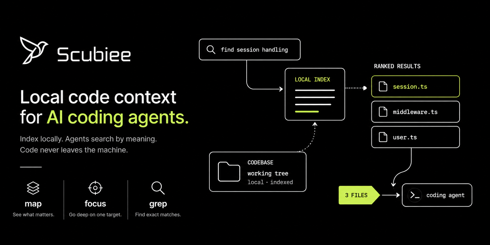

<p align="center">
  
</p>

<p align="center">
  <b>Local context engine for AI coding tools.</b><br>
  Index your repository on your machine. Agents <code>map</code> · <code>focus</code> · <code>grep</code> by meaning — not random search.<br>
  <i>Code never leaves the machine.</i>
</p>

<p align="center">
  <a href="https://pypi.org/project/scubiee/"></a>
  <a href="https://pypi.org/project/scubiee/"></a>
  <a href="https://github.com/Usmansayed/new-context-engine"></a>
</p>

---

Type `scubiee connect` once, and your AI coding assistant gets a **local index** of the repo — ranked discovery, deep focus, and exact search — instead of grepping blindly through files.

- **Fully local** — tree-sitter + embeddings on your disk; code never leaves the machine (model downloads once at setup).
- **Built for agents** — MCP tools `map` · `focus` · `grep` in Cursor, Claude Code, Copilot, Kiro, and more.
- **Not a cloud index** — a real local engine with live Merkle sync, not an upload-to-vendor RAG.

<p align="center">
  
</p>

---

## Get started (about a minute)

Requires **Python 3.10+**. Recommended installer: [uv](https://docs.astral.sh/uv/).

```bash
uv tool install scubiee
scubiee setup
cd /path/to/your/repo
scubiee init .
scubiee connect --cursor   # or --claude-code, --copilot, --all, …
```

Then **reload MCP** in your IDE (Cursor: Settings → MCP → refresh).

That's it. `init` indexes the repo. `connect` wires the IDE. You need both.

<details>
<summary>pip / alternative install</summary>

```bash
pip install -U scubiee
scubiee setup
```

On Windows, pinning the PyPI index avoids stale uv caches:

```bash
uv tool install --force scubiee --index-url https://pypi.org/simple
scubiee setup --repair
```

</details>

---

## See it in action

<p align="center">
  
</p>

Scubiee walks your repository, harvests structure, and builds a local index agents can query — on your hardware.

---

## How it works

```text
  SETUP (once)          INDEX (per repo)         CONNECT (per IDE)
  scubiee setup    →    scubiee init .      →    scubiee connect --cursor
       │                      │                         │
       ▼                      ▼                         ▼
  Detect GPU/CPU         Parse + embed             MCP + agent rules
  Download model         Store under ~/.scubiee    Reload IDE MCP
```

```text
  AI coding tool  ──MCP──►  Scubiee engine (localhost)  ──►  ~/.scubiee
```

A small local daemon serves search. Background sync keeps enrolled repos fresh. One-time model download at setup (~270 MB); indexing and retrieval stay local.

---

## What agents get

| Tool | Role |
|------|------|
| **`map`** | Ranked files & symbols — overview without dumping bodies |
| **`focus`** | Deep context for one target (span, outline, neighbors) |
| **`grep`** | Exact search inside the **index** |
| **`gate` / `status`** | Tiny managed check at session start |

Also: `glob`, `workspace`, `expand`, and more — see the [MCP tools reference](docs/web-info/mcp-tools-reference.md).

---

## Highlights

- **Fully local** — source stays on disk; no cloud index
- **MCP-native** — one connect family for Cursor, Claude Code, Copilot, Kiro, Cline, Roo, Continue, Zed, OpenCode, and others
- **Live sync** — Merkle incremental updates after edits and pulls
- **Hardware-aware** — CUDA · DirectML · MLX · CPU, chosen at `setup`
- **Safe lifecycle** — pause one repo, stop globally, or `wipe` with confirmation
- **Honest uninstall** — `scubiee wipe --all --confirm` with audit of anything left on disk

---

## Everyday commands

```bash
scubiee status .                 # enrollment + freshness
scubiee sync .                   # incremental re-index after big changes
scubiee search "auth middleware" .
scubiee doctor .                 # readiness + install identity
scubiee upgrade                  # package + migrate + rebind MCP
```

| Goal | Command |
|------|---------|
| Pause indexing for one repo | `scubiee pause .` → later `scubiee activate .` |
| Stop Scubiee machine-wide | `scubiee stop` → later `scubiee resume` |
| Unmanage + delete one repo's data | `scubiee wipe . --confirm` |
| Full machine wipe | `scubiee wipe --all --confirm` |

**Note:** `engine stop` ≠ `scubiee stop`. Global stop tears down MCP until `resume`. Per-repo pause needs `activate`, not `resume`.

---

## Documentation

| Guide | Link |
|-------|------|
| Getting started | [docs/web-info/getting-started.md](docs/web-info/getting-started.md) |
| Install & debug | [docs/web-info/install-and-debug.md](docs/web-info/install-and-debug.md) |
| Commands (quick) | [docs/web-info/commands-reference.md](docs/web-info/commands-reference.md) |
| **Every CLI flag** | [web-info/complete-cli-reference.md](web-info/complete-cli-reference.md) |
| MCP tools | [docs/web-info/mcp-tools-reference.md](docs/web-info/mcp-tools-reference.md) |
| Repo lifecycle (pause / wipe) | [docs/web-info/repo-lifecycle.md](docs/web-info/repo-lifecycle.md) |
| Troubleshooting | [docs/web-info/troubleshooting.md](docs/web-info/troubleshooting.md) |
| How everything works | [web-info/how-everything-works.md](web-info/how-everything-works.md) |
| Product / website copy | [web-info/product-guide-for-website.md](web-info/product-guide-for-website.md) |

---

## FAQ

**Does `init` connect Cursor?**  
No. `init` indexes. `connect` writes MCP and rules. Then reload MCP.

**Does my code get uploaded?**  
No. Indexing and search are local. Only the embedding model downloads during setup.

**Agent says `managed: false`?**  
Run `scubiee init .` and `scubiee connect --cursor` in that project, then reload MCP. For Kiro / Copilot / Cline / Roo, run `connect` **inside each repo**.

**Windows "Access denied" on upgrade?**  
`scubiee unlock-tool`, then retry install / `scubiee upgrade`. Quitting the IDE helps; admin usually does not (file locks, not ACLs).

**Upgrade from 0.2.x?**  
See [What's changed since 0.2.88](docs/whats-changed-since-0.2.88.md), then `scubiee upgrade` and `scubiee setup --repair` if doctor reports missing libs.

---

## Support bundle

```bash
scubiee --version --verbose
scubiee setup --status
scubiee doctor .
scubiee list
scubiee diagnose --no-tests --desktop
```

Attach `Desktop/scubiee-diagnose.json` and a tail of `~/.scubiee/engine.log` when filing issues.

---

## Project

| | |
|--|--|
| **PyPI** | [pypi.org/project/scubiee](https://pypi.org/project/scubiee/) |
| **CLI / MCP key** | `scubiee` |
| **Data** | `~/.scubiee` · `<repo>/.scubiee` |
| **Current release** | 0.3.14 |

Contributors: editable install from this checkout — `uv pip install -e .` then `scubiee setup`. Maintainers: see `docs/publish-setup.md`.
