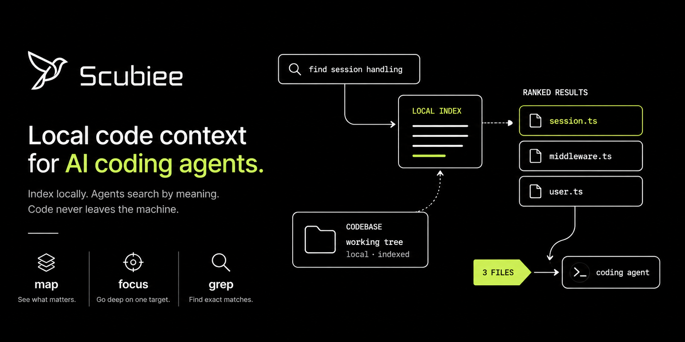

<p align="center">
  
</p>

<p align="center">
  <a href="https://pypi.org/project/scubiee/"></a>
  <a href="https://pypi.org/project/scubiee/"></a>
  
  <br>
  
  
  <a href="LICENSE"></a>
</p>

<p align="center">
  <b>A local code-context engine for AI coding agents.</b><br>
  Index your repository on your own machine, and let agents find code by <i>meaning</i> —
  so they read the few spans that matter instead of grepping blindly through files.
</p>

<p align="center">
  <a href="#quick-start">Quick start</a> ·
  <a href="#what-your-agent-gets">What your agent gets</a> ·
  <a href="#how-it-works">How it works</a> ·
  <a href="#documentation">Docs</a>
</p>

---

Run `scubiee connect` once and your AI assistant gets a **local, always-fresh index** of your
repo — ranked discovery and deep symbol focus — without uploading a single line of code.

- **Local-first.** Tree-sitter parsing + on-disk embeddings. Code never leaves your machine; the
  only network step is a one-time model download (~270 MB) during setup.
- **Built for agents.** Ships as an [MCP](https://modelcontextprotocol.io) server — works in
  Cursor, Claude Code, Copilot, Kiro, and other MCP clients.
- **A real engine, not cloud RAG.** A local daemon with live Merkle sync keeps the index current
  as you edit and pull — index once, stay fresh.

<p align="center">
  
</p>
<p align="center">
  <em>Ranked <code>map find</code> hits and focused symbol spans — all against a local index.</em>
</p>

---

## Quick start

**Prerequisite:** Python 3.11+. We recommend [uv](https://docs.astral.sh/uv/) as the installer.

```bash
# 1. Install
uv tool install scubiee

# 2. Set up once per machine (downloads the model, picks CUDA / DirectML / MLX / CPU)
scubiee setup

# 3. Index a repo (run inside the repository)
cd /path/to/your/repo
scubiee init .

# 4. Connect your IDE, then reload MCP in the IDE
scubiee connect --cursor
```

> `init` indexes the repo; `connect` wires up the assistant. You need **both**, then reload MCP
> (Cursor: Settings → MCP → refresh). Other clients: `--claude-code`, `--copilot`, `--kiro`,
> `--all`. See [getting started](docs/web-info/getting-started.md).

<details>
<summary>Prefer pip?</summary>

```bash
pip install -U scubiee
```

On **Windows with a GPU**, install so DirectML isn't clobbered on upgrade — see
[Windows / DirectML install](docs/scubiee-install-windows-dml.md).

</details>

---

## What your agent gets

One MCP tool — **`map`** — with two configs. The agent picks one by what it knows, acts on the
first good answer, and stops.

| `map` config | Use when | Returns |
|---|---|---|
| **`find`** | You don't know where the code lives | Ranked locations **with the top result's code inline** — usually no follow-up read |
| **`focus`** | You know the symbol name(s) | The symbol's full body **+ callers/callees + sibling names**, in one unit |
| **`gate` / `status`** | At session start | A tiny managed-repo check + engine health |

Scubiee is a **locate layer**, not a replacement for your editor. Exact string / path lookups stay
on the host's native **Grep / Glob / Read**, and history stays on **git** — a one-line grep is
faster and more precise than a semantic search for a known string. The CLI mirrors the tool:
`scubiee map --config find|focus`.

→ Full tool reference: [MCP tools](docs/web-info/mcp-tools-reference.md) ·
[the two configs, in depth](docs/scubiee-map-configs.md)

---

## How it works

```text
  setup (once)   →   init (per repo)   →   connect (per IDE)
      │                   │                      │
      ▼                   ▼                      ▼
  download model     parse + embed          MCP + agent rules
                     → ~/.scubiee           → reload IDE


  AI coding tool  ──MCP──►  Scubiee daemon (localhost)  ──►  local index (~/.scubiee)
```

A small local daemon serves retrieval over three fused channels — a code **graph**
(calls/imports/defines), **BM25** lexical match, and **dense** embeddings (CodeRankEmbed, FAISS).
Background sync keeps enrolled repos fresh with a Merkle diff, so edits show up in seconds without
a full reindex. Everything — indexing, embedding, retrieval — runs on your machine.

→ Architecture deep-dive: [how everything works](web-info/how-everything-works.md) ·
[system overview](docs/scubiee-overview.md)

---

## Everyday commands

```bash
scubiee sync .            # refresh the index after a big pull or refactor
scubiee status .          # enrollment + engine health
scubiee search "auth middleware" .   # search from the terminal, no IDE needed
scubiee doctor .          # diagnose setup / accelerator issues
scubiee upgrade           # update the package and rebind MCP
```

Pause / stop / wipe and the full lifecycle are in [repo lifecycle](docs/web-info/repo-lifecycle.md).
Every command and flag: [commands reference](docs/web-info/commands-reference.md).

---

## Privacy

- **Your code** is parsed and embedded locally and stays on disk — nothing is sent anywhere for
  search.
- **The model** downloads once during `scubiee setup` (~270 MB); after that, indexing works offline.
- Data lives under `~/.scubiee` (engine state) and `<repo>/.scubiee` (per-repo index).

---

## Documentation

| | |
|---|---|
| **Getting started** | [docs/web-info/getting-started.md](docs/web-info/getting-started.md) |
| **Install & debug** | [docs/web-info/install-and-debug.md](docs/web-info/install-and-debug.md) |
| **MCP tools reference** | [docs/web-info/mcp-tools-reference.md](docs/web-info/mcp-tools-reference.md) |
| **Troubleshooting** | [docs/web-info/troubleshooting.md](docs/web-info/troubleshooting.md) |
| **System overview** | [docs/scubiee-overview.md](docs/scubiee-overview.md) |
| **Full docs index** | [docs/README.md](docs/README.md) |

---

## FAQ

<details>
<summary><b>Does <code>init</code> connect my IDE?</b></summary>

No. `init` indexes the repo; `connect` writes the MCP config and agent rules. Run both, then reload
MCP in the IDE.
</details>

<details>
<summary><b>Does my code get uploaded anywhere?</b></summary>

No. Only the embedding model downloads (once, during `setup`). Parsing, embedding, and search all
run locally.
</details>

<details>
<summary><b>My agent says <code>managed: false</code>.</b></summary>

Run `scubiee init .` and `scubiee connect` inside that repo, then reload MCP. For Kiro / Copilot /
Cline / Roo, run `connect` inside each repo.
</details>

<details>
<summary><b>Windows: GPU acceleration stopped working after an upgrade.</b></summary>

Run `scubiee setup --repair`. To prevent it recurring, install with the DirectML override — see
[Windows / DirectML install](docs/scubiee-install-windows-dml.md).
</details>

<details>
<summary><b>Windows: "Access denied" during upgrade.</b></summary>

Run `scubiee unlock-tool`, then retry. Quitting the IDE first helps.
</details>

<details>
<summary><b>How do I file a bug with context?</b></summary>

`scubiee diagnose --no-tests --desktop` — attach the Desktop JSON plus a tail of
`~/.scubiee/engine.log`.
</details>

---

## Contributing

```bash
git clone https://github.com/Usmansayed/scubiee
cd scubiee
uv pip install -e .
scubiee setup
```

Issues and pull requests are welcome. Please run `scubiee certify` before opening a PR.

---

<p align="center">
  <a href="https://pypi.org/project/scubiee/"><b>PyPI: scubiee</b></a> ·
  Latest release: <b>0.3.144</b>
</p>

## License

Copyright © 2026 Usman Sayed.
Licensed under the [Apache License, Version 2.0](LICENSE).
