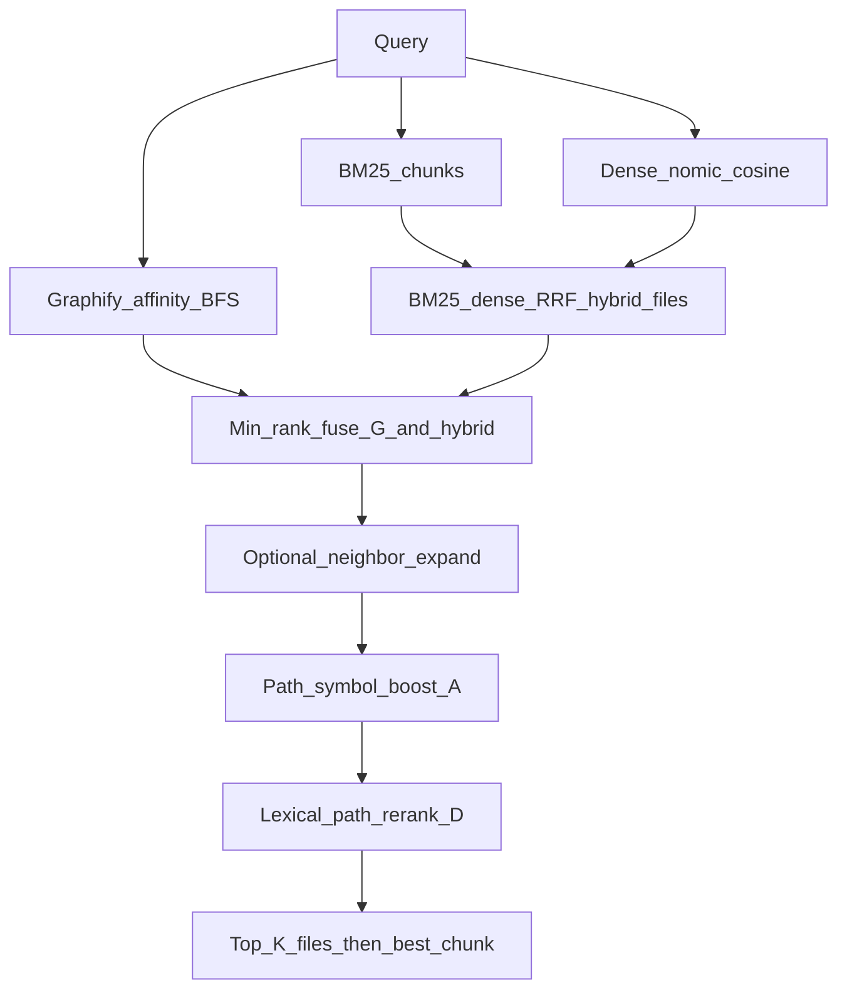

# Conductor — final production architecture

Date: 2026-08-01  
Corpus: `testdata/frontend-mcp` (Graphify graph + BM25 + nomic-embed-text 768)

## Final call

**Ship `D_rerank` as the only production retrieval default.**

| Arm | Role | Status |
|-----|------|--------|
| **`D_rerank`** | Production search for agents | **FINAL** |
| `baseline_graphify` | Structure-only (debug / symbol hunt) | keep as secondary tool, not default |
| `r_gated` / `D_floor` / `X_soft` / `R_complex` | Soft-router experiments | **REJECT for default** — lab soft wins; live OpenCode soft A/B net-negative |
| `C_gear` / `B_ppr` | Expand specialists | research only; diverse/consistency worse than D |

### Why D (evidence)

1. **Consistency gate** (suites + diverse + holdout v3): D best among controls (~90.4% consistency, diverse **94%**).
2. **Agent soft traffic (OpenCode):** Graphify alone fails paraphrases; D wins most soft useful hits.
3. **Router follow-up (`r_gated` OpenCode n=20):** tie 8, miss_both 9, D wins 2, r_gated wins 1 → **`KEEP_D_ONLY`**. Lexical Graphify injection (`time`→`timeout`, `graph`→graph `__init__`) clobbered D’s correct #5 hits.
4. Soft-30 lab made floors look good; **second held-out soft sheet overturned promotion**. Architecture must follow the harder agent test.

Weak local embeddings explain many **miss_both** cases; they do **not** justify shipping a lexical floor that hurts D’s ranking.

---

## Production algorithm (`D_rerank`)

Implemented in [`packages/conductor/architectures.py`](../packages/conductor/architectures.py) as `retrieve_D_rerank` (pool from `A_minrank_expand`).



### Stage detail

1. **Channels (parallel)**  
   - Graphify: query terms → IDF/tier seeds → BFS (depth ~2) → chunk/file affinity  
   - BM25 over code chunks  
   - Dense cosine (`nomic-embed-text` @ Ollama)

2. **Hybrid file list** — BM25+dense RRF (Claude Context–style), `k=60`, weights ~`bm25=1.0`, `dense=0.5`.

3. **Min-rank fusion (A)** — each file keeps `min(rank_graph, rank_hybrid)`; small bonus if both lists agree; soft-rank neighbor files of seeds.

4. **Path/symbol boost** — basename / path-token overlap with query keys.

5. **D lexical/path rerank** — score ≈ exact basename + path overlap + BM25 + dense + small graph term; reorder pool → top‑K files; pick best chunk inside file.

No LLM router. No always-on Graphify floor. Graph is a **channel inside fusion**, not a post-hoc injector on soft NL.

### Defaults (`ConductorConfig`)

- `rrf_k=60`, `bm25_weight=1.0`, `dense_weight=0.5`  
- Candidate pool ~40–80 before rerank  

---

## What we explicitly do not ship

- **Soft lexical floor / `r_gated` as default** — injects false friends on vague English.  
- **Graphify-only as agent search** — fine for identifier queries; fails soft intent.  
- **Query router to C_gear for paraphrase** — helped some holdouts, taxed diverse.  
- Dual product behavior “call Graphify **or** hybrid” — one ranking for search.

Optional later (not blocking ship): stronger code embedder, HyDE/query expansion, cross-encoder rerank — those address miss_both without undoing D.

---

## API surface (unchanged roles)

| Endpoint / mode | Use |
|-----------------|-----|
| `mode=d_rerank` / default search | **Production** |
| `POST /compare` | Graphify vs D (structure A/B) |
| `POST /compare_rgated` | Research only — do not promote from one soft sheet |
| `mode=graphify` | Symbol/structure debug |

Engine: [`packages/conductor/service.py`](../packages/conductor/service.py).

---

## Regression commands

```powershell
$env:PYTHONPATH = "packages;."
.\.venv\Scripts\python -u conductor_top3_benchmark.py
.\.venv\Scripts\python -u scripts\run_soft_arch_bakeoff.py
```

Promote any successor only if: soft agent judgment does not regress **and** consistency ≥ D **and** diverse macro does not fall.
